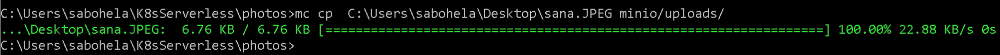

# 6. Kubeless


## 6.1 Install Kubeless

Kubeless [installation procedure](https://kubeless.io/docs/quick-start/) is well documented.  We will repost steps here for convenience and predictability, and use the v1.0.1 release.

```
kubectl create ns kubeless
kubectl create -f https://github.com/kubeless/kubeless/releases/download/v1.0.1/kubeless-v1.0.1.yaml
```

You should see that all of the resources come up:

```
kubectl get all -n kubeless
```

This shows the following:

```
NAME                                               READY     STATUS              RESTARTS   AGE
pod/kubeless-controller-manager-574cf75749-qxdcg   0/3       ContainerCreating   0          1m

NAME                                          DESIRED   CURRENT   UP-TO-DATE   AVAILABLE   AGE
deployment.apps/kubeless-controller-manager   1         1         1            0           1m

NAME                                                     DESIRED   CURRENT   READY     AGE
replicaset.apps/kubeless-controller-manager-574cf75749   1         1         0         1m
```

## 6.2 Patch the Python Runtime

Each serverless function runs in a container.  We call this the `runtime` container.  You can see the runtime environments on the [Kubeless GitHub page](https://github.com/kubeless/runtimes).  As serverless is new, and constantly evolving, things change quick.  However this also means that certain features you may want for your apps are not included in the runtimes.  

The features of [CORS](https://developer.mozilla.org/en-US/docs/Web/HTTP/CORS) and file uploads are not included.  Fortunately, we can patch this by using our own runtime environment.

### 6.2.1 What is CORS?

CORS is _Cross-Origin Resource Sharing_. When the web application is from one origin (the minio IP address), and the API is at another origin (the ingress controller IP address), then we have to specifically allow connections from different locations using [CORS](https://developer.mozilla.org/en-US/docs/Web/HTTP/CORS).  We end up putting a header in the API response that tells the web browser that we will accept connections from it.

### 6.2.2 Update the ConfigMap    

We have already prepared a new runtime environment for this lab.  To use it we have to modify the [ConfigMap](https://kubernetes.io/docs/tasks/configure-pod-container/configure-pod-configmap/) that we just installed with Kubeless. To see it run:

```
kubectl get cm -n kubeless
```  

To modify it we run:

```
kubectl edit cm -n kubeless kubeless-config
```

This will put us in a `vi` session.  We will look for the following lines:

```
"python:2.7", "phase": "installation"}, {"env": {"PYTHONPATH": "$(KUBELESS_INSTALL_VOLUME)/lib/python2.7/site-packages:$(KUBELESS_INSTALL_VOLUME)"},
"image": "kubeless/python@sha256:34332f4530508a810f491838a924c36ceac0ec7cab487520e2db2b037800ecda",
```

Very carefully replace the python runtime image with:

```
"python:2.7", "phase": "installation"}, {"env": {"PYTHONPATH": "$(KUBELESS_INSTALL_VOLUME)/lib/python2.7/site-packages:$(KUBELESS_INSTALL_VOLUME)"},
"image": "vallard/kubeless-pythonf:2.7",
```

### 6.2.3 Restart the `kubeless` pods

Now we will delete the controller pod, so that it re-reads the ConfigMap:

```
kubectl delete pods -n kubeless -l kubeless=controller
```

This should enable CORS and make file uploads possible on our python runtime containers.

## 6.3 Install Kubeless Client

### 6.3.1 Windows

Download the `kubeless` client from the [releases page](https://github.com/kubeless/kubeless/releases/tag/v1.0.1)

### 6.3.2 Mac & Linux

```
export RELEASE=v1.0.1
export OS=$(uname -s| tr '[:upper:]' '[:lower:]')
curl -OL https://github.com/kubeless/kubeless/releases/download/$RELEASE/kubeless_$OS-amd64.zip &&   unzip kubeless_$OS-amd64.zip &&   sudo mv bundles/kubeless_$OS-amd64/kubeless /usr/local/bin/
```

## 6.4 Deploy a test function

Following the quickstart guide we can create a simple *hello* function.  

### 6.4.1 Create the `function01.py` file

Using your favorite editor, create a file named `function01.py`.  Make the contents look as follows:

```
def hello(event, context):
  print event
  return event['data']

```
(alternatively, download it from [here](https://raw.githubusercontent.com/vallard/K8sServerless/master/kubeless/function01.py))

### 6.4.2 Deploy `function01.py1` with Kubeless

To deploy it, we run:

```
kubeless function deploy hello --runtime python2.7 \
                     --from-file function01.py \
                     --handler test.hello
```

This will deploy a function named `hello` that will run in a python *runtime*.  It will use the `function01.py` file, and the `hello` function from this file.  As you can see the `test` isn't used in python, but this should normally match the file name or module.

You'll then see with `kubectl` that new pod coming up:

```
kubectl get pods,svc -l function=hello
```

### 6.4.3 Debugging Kubeless

If you see `ErrImagePull` in the status it means the runtime was improperly typed and needs to be changed.  Repeat the steps above, restart the controller and you should see it correctly deployed.

One way we can tell what is wrong is by running:

```
kubectl logs -f <pod_name>
```

Where `<pod_name>` is the name of the pod that is failing.

Kubeless creates a [deployment](https://kubernetes.io/docs/concepts/workloads/controllers/deployment/) and a [service](https://kubernetes.io/docs/concepts/services-networking/service/)

```
kubectl get pods,services -l function=hello
```

This service, by default, is of type `ClusterIP`, so it can be called internally but not reached externally, unless we create an ingress rule or configure the service as `LoadBalancer`.

### 6.4.4 Test the `hello` function

We can then call the function by either using a [proxy](https://kubernetes.io/docs/tasks/access-kubernetes-api/http-proxy-access-api/), or spin up our own container to run.  Let's use our own container to talk to it.

```
kubectl run alp --image=alpine -- sleep 60000
```

This will deploy a `pod alp-xxxxxxxxxx-xxxxx`. Please wait until you see it *Running*:

```
kubectl get pods
```

And then log into this pod with:

```
export AL=$(kubectl get pods | grep alp | awk '{print $1}')
kubectl exec -it $AL /bin/sh
```


This will put you *in* the pod.  From there we can now call the *hello* function, since the pod has access to the function's service `ClusterIP` (only reachable for pods inside the cluster):


```
apk add --no-cache curl  # install curl
curl -L --data '{"Another": "Echo"}' \
  --header "Content-Type:application/json" \
  hello:8080
```

This will return exactly what you sent to it:

```
{"Another": "Echo"}
```

**Our first function-as-a-service works!**

Notice that the way we call other functions or services in kubernetes follows the form:

```
<svc>.<namespace>.svc.<cluster_domain>
```

In this case it was:

```
hello.default.svc.cluster.local
```


So you could also try something like this:

```
curl -L --data '{"Another": "Echo"}' \
  --header "Content-Type:application/json" \
  hello.default.svc.cluster.local:8080
```

By default we are in the same namespace, so we could leave everything else off and just use `hello`.


### 6.4.5 Delete Sample Function

Exit out of the container and delete the `hello` function

```
exit
kubeless function delete hello
```

Kubeless deletes the deployment and the service, so it's a bit cleaner than using `kubectl` to remove everything.


## 6.5 Photo Image Resize Function

Let's make a function that builds upon our Minio configuration, and creates a thumbnail image of our image whenever we upload it to Minio.  This is an image that can then be displayed by mobile clients, should we ever create a mobile app for our service.  The `event` in this case is a file upload.  This will trigger a call to a photo *resize* function that we will create.  

### 6.5.1 Make Buckets

We will use this function in our big application.  Let's make some buckets first:

```
mc mb minio/uploads
mc mb minio/thumbs
```

### 6.5.2 Activate Webhooks

You can add `webhooks` to Minio.  We already added these with the config file you used to create the helm chart in the beginning (you may have seen this in a previous challenge).  Run the command:  

```
mc admin config get minio
```

You will see an entry:

```json
"webhook": {
			"1": {
				"enable": true,
				"endpoint": "http://thumb:8080"
			}
		}
```

This is the first webhook `1` that is available to us.  This entry just defines what endpoint will be notified when a relevant event occurs.  Let's define that event as the upload of a file to the *uploads* folder in Minio:

```
mc event add minio/uploads arn:minio:sqs:us-east-1:1:webhook --event put
```

You could also define the specific type of files to be considered as an *event*, filtering by file extensions. But this is specially difficult for photos, as they can use multiple different extensions: JPEG, jpg, Jpeg, etc.  For our event definition we are not using any filter, so all uploaded files will trigger a notification.

We can now see the webhook is ready:

```
mc admin info minio
```

### 6.5.3 Bypass security (don't do this at home!)

Make rules, so we can access the secrets with our python script (otherwise it crashes).  **This is insecure!**  However, we will use it just to make it work for now:

```
kubectl create clusterrolebinding \
	default-cluster-admin --clusterrole=cluster-admin \
	--serviceaccount=default:default
```

### 6.5.4 Get `resize.py`

Download the `resize.py` function from [here](https://raw.githubusercontent.com/vallard/K8sServerless/master/kubeless/resize.py).  Examine the contents.  A few of our functions will look similar.  We first grab the secrets from Kubernetes, so that the function can log into Minio.  

Next, we download the file, and then use the python [Pillow library](https://python-pillow.org/) to open the file and make the image smaller.  Once we do that, we try to upload it back to Minio in the `thumbs` directory, with the same name but with `.thumb` appended to it.   

### 6.5.5 Get `requirements.txt`

Download the `requirements.txt` file from [here](https://raw.githubusercontent.com/vallard/K8sServerless/master/kubeless/requirements.txt)

The runtime will not have all the python requirements we need.  For this purpose we put them in a file that we can tell Kubeless to download them for us later.

### 6.5.5 Create `resize` function

Now we can add our function:

```
kubeless function deploy thumb \
 --runtime python2.7 \
 --handler resize.thumbnail \
 --from-file resize.py \
 --dependencies requirements.txt
```

Wait until it shows up us *Running*:

```
kubectl get pods -l function=thumb
```

### 6.5.6 Test the `resize` function

Now upload an image to the `uploads` bucket, and **please make sure the extension is `jpeg` or `JPEG`**.  




You should instantly see a smaller version appear in the `/thumbs` directory!

If it didn't work, check your extension again.  Then use some of the debugging tools we looked at earlier:

```
kubectl logs -f <pod_name>
```

### 6.6 Kubeless Conclusion

This module shows how `kubeless` can create functions.  They are quick and powerful.  They create services and pods.  We don't need to worry about creating the containers for our runtimes, and can just focus on writing code.  In this case we just wrote some python code and the service put it into containers ready to use.  

* No `Dockerfile` required.
* No `yaml` files created.  

But how would you test such a function in a serverless world?  How do you iterate?  How do you do rollbacks?  How do you integrate it into a CI/CD pipeline?  Many of these questions are still being looked at and have not been solved in a one size fits all manner.

##### Challenge 6.1: Explain the trail of how Minio calls the resize function.  How does `thumbs:8080` fit into this?

##### Challenge 6.2: Change the function to accept .gif, .png, and .jpeg extensions.

###### Challenge 6.2 Hint:

After changing the code you need to update the function with the following command:

```
kubeless function update thumb -f resize.py
```

##### (optional, but don't do it) To remove the notification you would run:

```
mc event remove minio/uploads arn:minio:sqs:us-east-1:1:webhook
```

## Sources

* [https://kubeless.io/docs/quick-start/](https://kubeless.io/docs/quick-start/)
* [https://github.com/kubeless/functions/blob/master/incubator/minio-resize/resize.py](https://github.com/kubeless/functions/blob/master/incubator/minio-resize/resize.py)

## Where to next?

__End of Part 1!__

* [Go Back Home](../README.md)
* [Previous Module: Minio](../minio/README.md)
* [Next Module: Application Overview!](../photos/OVERVIEW.md)
