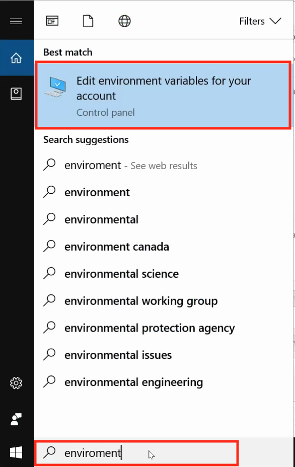
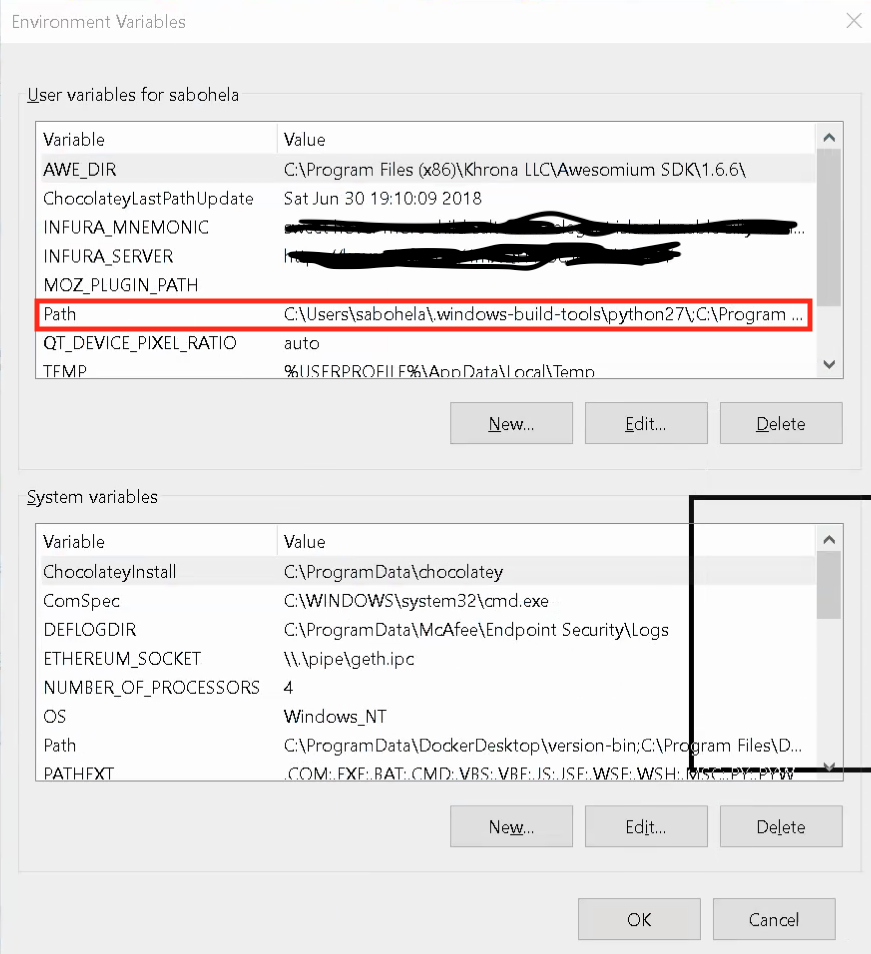
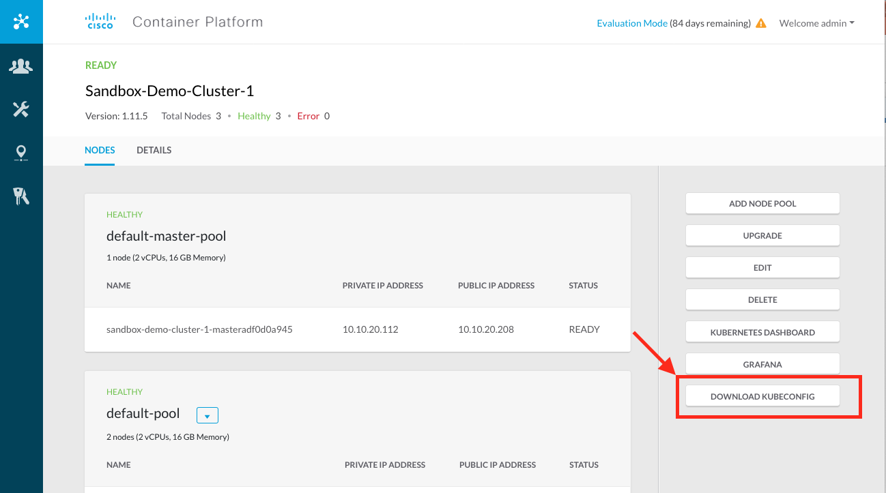
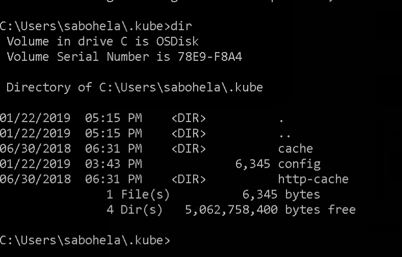
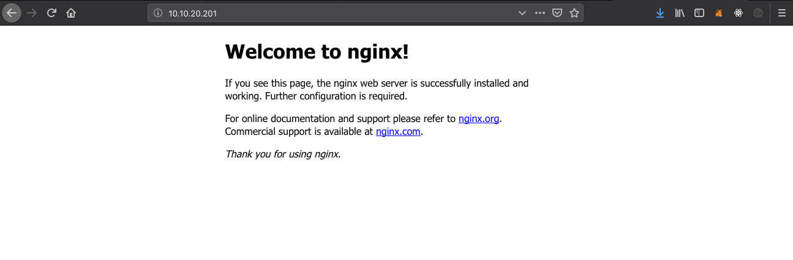
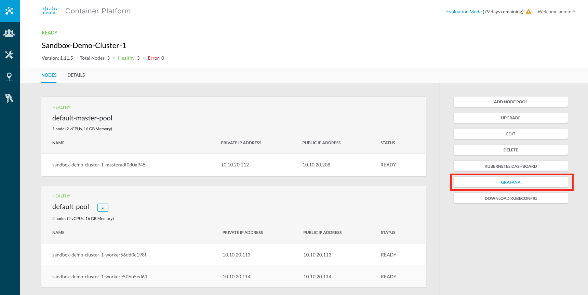

# 2. CCP Kubernetes

Cisco Container Platform (CCP) provides an environment where we are able to launch Kubernetes clusters and manage the lifecyle of the clusters including easy updates and migrations.

In this module we will show some Kubernetes commands we will be using to navigate around our cluster.

## 2.1 Get `kubectl`

Kubernetes is managed through the command line with the [`kubectl`](https://kubernetes.io/docs/tasks/tools/install-kubectl/) command. Pronounced _kube control_ or _kube cuddle_ by those who feel more pleasure from it.

In order to do the exercises in this course you will need to have this installed on your machine.  Fortunately, its pretty easy.  Please take time to look at the official [Kubernetes Documentation](https://kubernetes.io/docs/tasks/tools/install-kubectl/) and install `kubectl`.

For quick installations (no package manager system) you can simply download the binaries using the below instructions.  

### 2.1.1 Windows

1. [Download Binary](
https://storage.googleapis.com/kubernetes-release/release/v1.13.0/bin/windows/amd64/kubectl.exe)
2. Put the binary in your path.  This can be done by creating a directory for `kubectl	` and putting that directory into the path, or putting `kubectl` into a directory that is already in your path.

To change environment variables in Windows, type 'environment` in the search bar and open the environments program.



You can then see the PATH variable and edit that. 



### 2.1.2 MacOS

Download with curl:

```
curl -LO https://storage.googleapis.com/kubernetes-release/release/$(curl -s https://storage.googleapis.com/kubernetes-release/release/stable.txt)/bin/darwin/amd64/kubectl
chmod +x ./kubectl
mv ./kubectl /usr/local/bin/
```

### 2.1.3 Test `kubectl`

To make sure it works run:

```
kubectl version
```

You may see an error about `localhost:8080 was refused`, that's ok, you are still a good person. The important thing is that you get output and that it is in your path.  

## 2.2 Kubernetes Credentials

In the [previous module](../sb/README.md) you opened a web page to CCP.  On this page there is a preconfigured Kubernetes cluster for you.  While you can create new clusters if you want, we will use this Kubernetes cluster for our system.  It is called `Sandbox-Demo-Cluster-1`.  Click on the cluster and you will come to a page that shows details of the cluster.  Download the kubeconfig file



This will save a file named `kubeconfig.yaml`.  To make use of this with `kubectl` make a directory in your home directory called `.kube` (don't forget the period as part of the name).  If you already have a `.kube` directory in your home directory, it's all good and we'll use it.  Then move the `kubeconfig.yaml` to `.kube/config`.  

### 2.2.1 Windows Example

```
mkdir -p c:\Users\<yourname>\.kube
```
Move the `kubeconfig.yaml` file into the `.kube` directory and rename it as `config` (no extensions)



### 2.2.2 Mac Example

```
mkdir -p ~/.kube
mv ~/Downloads/kubeconfig.yaml ~/.kube/config
```

### 2.2.3 Verify `kubectl` connectivity to cluster

To make sure you are connected to your cluster, run the command:

```
kubectl cluster-info
```

This should return the information about your cluster:

```
Kubernetes master is running at https://10.10.20.208:6443
KubeDNS is running at https://10.10.20.208:6443/api/v1/namespaces/kube-system/services/kube-dns:dns/proxy
```

If you are not connected to your cluster quite yet, get help before moving to the next step.  

## 2.3 A whirlwind tour of Kubernetes

Now that we have kubernetes up and running and we can connect to it, it's time to start running some applications.  

If you are familiar with `docker` commands you will find many similarities with `kubectl` commands.  

### 2.3.1 Namespaces

Each cluster can have multiple namespaces.  A namespace is a logical way to seperate a group of applications or resources.  We can see all the namespaces by typing:

```
kubectl get namespaces
```
Here you will see 4:
```
NAME          STATUS    AGE
ccp           Active    2d
default       Active    2d
kube-public   Active    2d
kube-system   Active    2d
```

Kubernetes resources (like Pods, ConfigMaps, Secrets, etc) live in a namespace.  

Let's create a new namespace called `test`.

```
kubectl create namespace test
kubectl get ns test
```

##### Challenge 2.1: Delete the test namespace.  

### 2.3.2 Pods

Let's take a look at all the pods in our current namespace:

```
kubectl get pods
```

As you can see there are not any.  But I assure you there are pods running, just not in your namespace.

Kubernetes runs inside Kubernetes.  Those resources in CCP, and most Kubernetes distributions, run inside the `kube-system` namespace.  We can look at all the pods in there by running:

```
kubectl get pods -n kube-system
```

You will see quite a few containers running here.  These are the containers that keep Kubernetes running.

##### Challenge 2.2:  How can you list all pods in all namespaces?  (hint: kubectl get --help)


##### Challenge 2.3: How can you list all the details about a pod, including its IP address and what node it is running on?

##### Challenge 2.4: How can you watch for new pods or changes to the pods in a continuous loop using `kubectl`?

### 2.3.3 Deployments

Deployments tell pods how they should be deployed.  Let's deploy a [nginx](https://www.nginx.com/) service.  

```
kubectl run ngx1 --image=nginx --replicas=3
```
This will deploy 3 nginx pods.  You'll see them all become `ready` as the image is downloaded and pods start.

We can kill some of the pods and they will be recreated. Kill one of your pods by running:

```
kubectl delete pod <pod_name>
```

You'll see it deleted and then a new one will be created in its place.  This is one of the great points about Kubernetes.  We declare what we want and if anything is found out of sync then it makes it right again.  We told our deployment, when we created it, we wanted to have 3 replicas.  Kubernetes will try to ensure there are always 3 replicas running.   

##### Challenge 2.5: Scale the deployment to 4 replicas. (Hint: kubectl scale --help)

### 2.3.4 Services

Our pods may go up and down as we update the application.  As they go up and down, the names and IP addresses of the pods change.  We want to ensure that other applications are able access our application by one consistent name.  Later we will deploy MongoDB and our applications will need to know the consistent name they can reach Mongo from.  Kubernetes provides the concept of a [service](https://kubernetes.io/docs/concepts/services-networking/service/).  It's basically like a virtual IP address that will load balance (round robin) between all the pods backing it.  

Let's create a service:

```
kubectl expose --port 80 deployment ngx1
```

This will create a service we can see with:

```
kubectl get svc
```

We notice there are two IP addresses a service can have.  An internal IP known as the `ClusterIP` and an `External IP`.  The `ClusterIP` is how the pods can reach this service **from inside** the cluster.  However, if we want to be able to access this service **from outside** the cluster we need to give it an `External IP`.  We can change that by giving the service a [LoadBalancer](https://kubernetes.io/docs/concepts/services-networking/service/#loadbalancer) IP address.  By default services just get cluster internal IP addresses.  

To change this we run:

```
kubectl edit svc ngx1
```
We will be placed into a text editor. At the bottom of the file you will see (about line 25):

```yaml
  type: ClusterIP
```

Change this to be:

```yaml
  type: LoadBalancer
```
Saving this file will make the changes happen in Kubernetes.  To see the output run:

```
kubectl get svc
```

You'll see an `EXTERNAL-IP` address you can now access.  Point your web browser to this:



Alternatively, you can use the IP address of your cluster (see the results of the `cluster-info` command earlier) with the mapped port seen in the `get svc` command after `80:`.

### 2.3.5 Ingress

CCP comes installed with an Ingress Controller.  An ingress controller allows traffic from the outside to be routed into services inside the cluster.  For example, if we had an app but we wanted one of the directories to be `/blog` we might want traffic coming into the app with the `/blog` directory to get routed to a different application.  It would look from the outside like the same application but internally it would run on different pods.

Let's illustrate it with an example.

##### Challenge 2.6: Change the `ngx1` service back into type ClusterIP

With the service back to `ClusterIP` we can't access it from the outside.  However, we have an ingress controller:

```
kubectl get svc -n ccp nginx-ingress-controller
```

Don't mistake the name here.  It happens to be that we are using `nginx` as an [ingress controller](https://kubernetes.io/docs/concepts/services-networking/ingress/#ingress-controllers).  But we are also using `nginx` as our application for serving up web pages.  It's quite flexible!  

This ingress controller has an `EXTERNAL-IP`.  We can make a rule that when someone goes to that IP address (or DNS entry) we can layer 7 route it to the `ngx1` application.

[Download the ingress rule yaml](https://raw.githubusercontent.com/vallard/K8sServerless/master/kubernetes/ngx1-ing.yaml) file and open it up to edit it.  

We are using [xip.io](https://xip.io) to redirect since we don't have an external domain name associated with our IP addresses.  

Change the IP address to match the IP address of your `EXTERNAL-IP` of the ingress controller you found above.  Keep the xip.io extension at the end:

```yaml
  ...
  - host: ngx1.10.10.20.200.xip.io  #<- change this line
  ...
```

Next create the ingress rule with:

```
kubectl create -f ngx1-ing.yaml
```

Assuming you were able to change the `ngx` to `svc` then you will be able to see that now it is routing to your backend pods:

```
kubectl get ing
```

Now you should be able to open the browser again to:

[http://ngx1.10.10.20.200.xip.io/](http://ngx1.10.10.20.200.xip.io/) and see the same happy nginx page.  __Note:__ you should make sure it's your ingress controller service IP address that you point it to.

Why did we use `xip`?  Well, the ingress controller works by examining what the domain name was on the HTTP request.  It uses the domain name then to route to the appropriate Kubernetes service by following the ingress rule that you created.

## 2.4 Other CCP Kubernetes

CCP comes built in with monitoring and [Prometheus](https://prometheus.io/).  The support is there with Cisco TAC so this offers exceptional value.  

Let's log into the monitoring of our project by going back to the Kubernetes dashboard and looking at Grafana.



Confirm the security exceptions.  The username is `admin`. To get the password use the following command on a mac:

```
kubectl -n ccp get secret ccp-monitor-grafana -o=jsonpath='{.data.admin-password}' | base64 -D
```

If you don't have the base64 command or pipe run the command and then go to an online [base64 decoder site](https://www.base64decode.org/)

The monitoring on sandbox is a little rough given that it is an emulated environment. However seeing it all laid out can be handy.  


## 2.5 Conclusion

This concludes our brief tour of Kubernetes.  We will be using services, pods, deployments, ingress controllers and some other things we didn't cover as well later on. We just need to add some more infrastructure components before we can construct our application!


## Where to next?

* [Go Back Home](../README.md)
* [Previous Module: Cisco Sandbox](../sb/README.md)
* [Next Module: What the Helm?](../helm/README.md)
