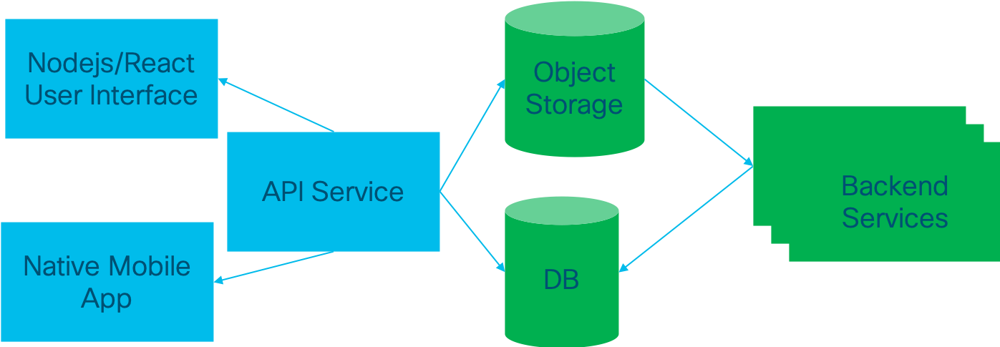
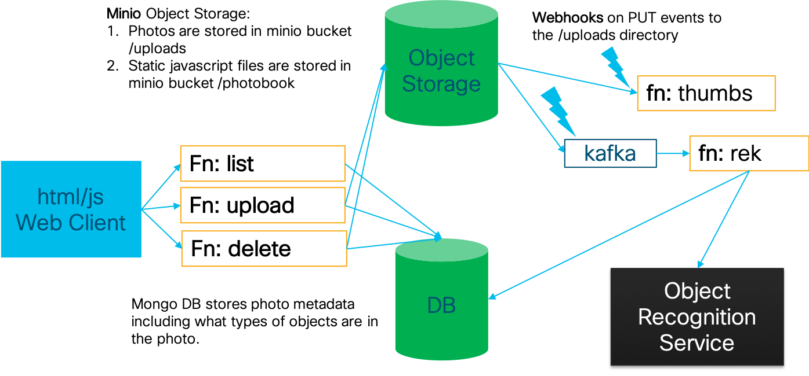

# 7. Photos Application Overview

Our application is a photobook application where we can upload photos.  The photos will then get thumbnails created (already did that part!), and then will be sent to an object recognition service that will tag the photos with different objects that are detected in them. 

It is important to understand the application components.  They are as shown in the diagram below:



The basic design is that there is an API where different clients (mobile, web, alexa, chatbots, etc) can interact and change the state of the objects in the database and object storage.  These items in blue are open and accesible by the users.  The back-end components in green are not touched by the user but instead are changed as a result of interactions with the application.  

On the back-end we may have a number of services that do analytics, batch processing, or other things that the organization wants to have happen.

This is really the structure of many cloud-based applications from AirBnB, Netflix, etc.  The differences being that there are many operations, more databases, more backend services, and more APIs.  Yet reduced to its core, applications are just fetching and mutating data in the database.  We will briefly look at each component before diving in.

## 7.1 Understanding Static Webpages

The first part of the application is the static webpage.  In many applications today we create a bundle of files that include [HTML](https://www.w3schools.com/html/html_intro.asp), [CSS](https://www.lifewire.com/what-is-css-3466390), and [JavaScript](https://www.thoughtco.com/what-is-javascript-2037921).  This bundle of files is compressed and can be served from a read-only object store.  That is where Minio comes in.  Instead of creating a web server, like [Tomcat](https://en.wikipedia.org/wiki/Apache_Tomcat) or [Apache](https://www.wpbeginner.com/glossary/apache/), we simply put it on an object store.  The key to this is that all of these files mentioned above are *static*.  The browser downloads them, and then the browser interprets them locally and runs the JavaScript code.

There are many choices we can use, but fundamentally we will be using JavaScript.  The logos below give you an idea of what choices we have made in this application.


## 7.2 Function-as-a-Service

Static webpage assets are served to your browser. But when the browser runs them locally, the included JavaScript code will need to make calls to an API.  This is similar to how mobile applications function.  You may download the app from the app store, but then it operates on your phone making calls to services external to the phone.  

We will build three functions the client will use to interact with our app:

```
$API_SERVER/images/list GET
$API_SERVER/images/upload POST
$API_SERVER/images/delete DELETE
```

These three functions are the individual functions we will build with `kubeless`. 

You will notice there is no authentication in our application.  It may be that some other team is responsible for that portion and creates a separate API for that.  We could then use that API to log users in to upload photos. 

The functions have one operation and are rather self-explanatory: 

* `list` - Get the database of photos and return the URL of each photo, as they are stored in the object storage. 
* `upload` - Upload a photo to our object store and write object metadata about the photo into the MongoDB database.
* `delete` - Delete the photos from the database as well as the object storage. 


## 7.3 Back-end Processing 

Back-end processing are jobs that happen as a result of data being changed, added, or deleted.  In our case we have two back-end processes that will happen as a result of events. 

The first is the `resize` function we implemented already.  Anytime a photo is uploaded to the `/uploads` object storage bucket, we will modify the size of that image and then store it in the `/thumbs` directory for any mobile clients to make use of. 

The second is the object recognition service (we haven't done this yet).  When a photo is uploaded to the `/uploads` directory we will run the photo through our detection algorithm, and then add the objects we detected to the MongoDB entry for that particular photo. 

Sometimes backend processes take all night to run.  Sometimes they take less time.  Regardless, backend processing is something we want to be loosely integrated into the application. We can change, add, delete or modify the different services as we like, without interrupting the flow of the application. 



Now that we have a big overview of the application let's dive in and build the three functions that will comprise the API of our application. 

## Where to next?

* [Go Back Home](../README.md)
* [Previous Module: Kubeless](../kubeless/README.md)
* [Next Module: Serverless](../serverless/README.md)
