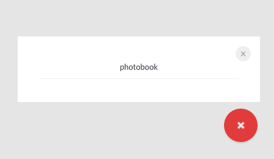
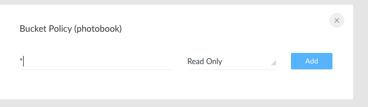
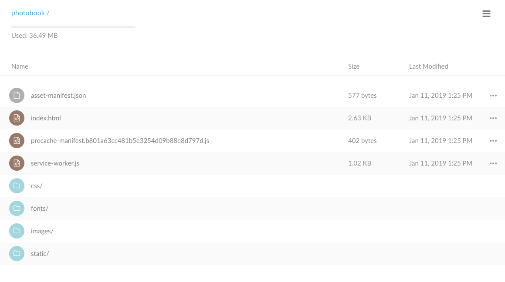
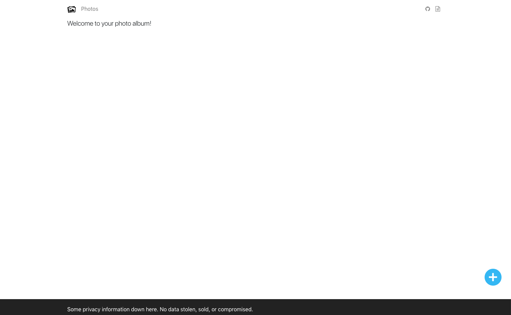
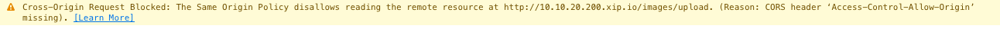
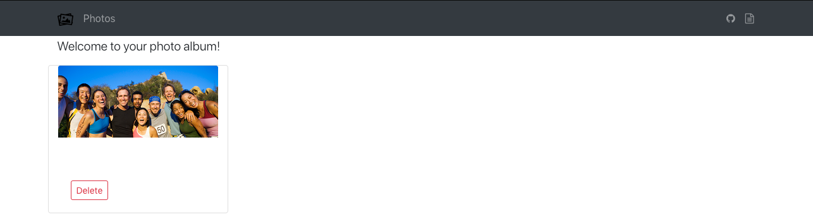

# 9. NodeJS Front-end Photos

We are now ready to make this application pretty and usable! This front-end application was written as a [React Application](https://github.com/facebook/create-react-app).  React is a JavaScript framework to develop our application.  Other common modern frameworks used today are [Angular](https://angularjs.org/) or [Vue](https://vuejs.org/).  How do you choose which one to use? You can go through this [thorough analysis](https://medium.com/@TechMagic/reactjs-vs-angular5-vs-vue-js-what-to-choose-in-2018-b91e028fa91d), but the truth is that anyone of those is probably a fine choice. 

... although, one training company, Code School, definitely gave Angular JS the best theme song.  Have a look:

[](https://youtu.be/PF3qr7mMmgA)


## 9.1 Deploy Object Store Bucket for Code

Don't worry there isn't much to install now as you've done it all.  We'll just configure some items and get to work. 

### 9.1.1 Setup Minio

We need to add a bucket and policies to our object store. We want to host the application in this bucket, but it must be read only by everyone in the world.  In buckets where web content is stored, we must ensure that everything is public and don't put any sensitive data. 

You can configure the policy by either using the web GUI (option A) or the command line client (option B).

#### 9.1.1.1 Option A: GUI Method
Log in to Minio and click on the big red + sign to create a bucket named `photobook`.



Once it is created, hover over the bucket name in the left side bar to reveal three vertical dots. Click on those three vertical dots to edit the policy. Create a __Read Only__ policy for every file by using the __*__.   



#### 9.1.1.2 Option B: Command Line

```
mc mb minio/photobook
mc policy -r download minio/photobook
```

Aren't command line instructions so succinct?

## 9.2 Get API information

Our front-end application needs to talk to the functions, but functions are called through the ingress controller.  We need to get the IP address of the ingress controller (again!) 

We can see all of this information by typing the command: 

```
kubectl describe ing photos
```

Then we see an ingress rule for each of our services.  The `Host` entry is set to something like `10.10.20.200.xip.io`.  This is our API endpoint. It even has the paths we need!

```
Name:             photos
Namespace:        default
Address:          10.10.20.113,10.10.20.114
Default backend:  default-http-backend:80 (<none>)
Rules:
  Host                 Path  Backends
  ----                 ----  --------
  10.10.20.200.xip.io
                       /images/list     list:8080 (<none>)
                       /images/delete   delete:8080 (<none>)
                       /images/upload   upload:8080 (<none>)
Annotations:
  kubernetes.io/ingress.class:                 nginx
  nginx.ingress.kubernetes.io/rewrite-target:  /
Events:
  Type    Reason  Age   From                      Message
  ----    ------  ----  ----                      -------
  Normal  CREATE  49m   nginx-ingress-controller  Ingress default/photos
``` 

## 9.3 Modify Static Web Files

You should have downloaded the source code for this exercise in the previous module.  Let's modify the application:

```
cd <src directory>./K8sServerless/photos
vi src/services/photos.js
```

At the top of the file change the API variable to yours:

```diff
- export const API = "http://10.10.20.200.xip.io"
+ export const API = "http://<your-IP>.xip.io"
```

Everything else should remain the same. 

## 9.4 Compile the Pages

In the `photos` directory build with npm:

```
npm install 
```

The install command might take a little while, ignore errors, aren't we all vulnerable?

```
npm run build
```

This will create all the resources we need in the `build` directory.


## 9.5 Upload the static web assets

We will copy everything to the `photobook` directory using the minio `mc` command line tool: 

```
mc cp --recursive build/ minio/photobook/
```

If you have the browser open, you should see all the elements in the Minio browser by refreshing:



Or you can run `mc ls minio/photobook`:

```
mc ls minio/photobook
[2019-01-11 13:25:19 PST]   577B asset-manifest.json
[2019-01-11 13:25:20 PST] 2.6KiB index.html
[2019-01-11 13:25:20 PST]   402B precache-manifest.b801a63cc481b5e3254d09b88e8d797d.js
[2019-01-11 13:25:20 PST] 1.0KiB service-worker.js
[2019-01-11 13:40:55 PST]     0B css/
[2019-01-11 13:40:55 PST]     0B fonts/
[2019-01-11 13:40:55 PST]     0B images/
[2019-01-11 13:40:55 PST]     0B static/
```

## 9.6 Access the Static Web Contents

Using the Minio URL (not the ingress URL you found above) you should now be able to access the web site.  Note that you don't put `minio` in the URL:

e.g: 
```
http://10.10.20.201:9000/photobook/index.html
```

Don't do: 

```
http://10.10.20.201:9000/minio/photobook/index.html
```

The webpage should then be visible: 



## 9.7 Test the Webpage

Alright, let's upload some photos to see what happens.  Click the *plus* icon at the bottom and see what happens.

### 9.7.1 Debugging

If you get no response open the javascript console and see what errors may have shown.  You may see something like: 



You can check your *upload* function:

```
kubeless function logs upload
```

Look for different errors you might have with database connections or python issues.

Unfortunately our application doesn't do a very good job in helping us debug problems.  In fact, as a developer you spend quite a bit of time writing for cases of malicious users.  Since none of you are malicious, I spent little time putting work like that into this application. :smiley:

## 9.8 Development

Perhaps there are changes you would like to make to the code?  To do that we can run the code locally and make changes.  React has a nice way of rendering and making changes as we change files. 
   
```
cd ./K8sServerless/photos
npm start 
```

This will bring up our page locally and allow us to make changes.  

### 9.8.1 Application Layout

Our lab directory has two folders that matter to us:

```
./public
./src
```

#### 9.8.1.1 Bootstrap for CSS

The `./public` directory is where we place all our images, fonts, and stylesheets, as well as the public `index.html` file.  The only part you may wish to change is the contents of `./public/css/main.css`. There isn't too much in it, because most of our CSS uses bootstrap.  The [documentation for bootstrap](https://getbootstrap.com/docs/4.0/getting-started/introduction/) is quite good and full of examples.  Therefore most of the changes you will do will just use bootstrap classes.  

The `./src/components` directory holds the parts that are rendered.  There is one file called `NavBar.js`.  

##### Challenge 9.1: Can you make the Navbar dark? 



Hint: look at the docs for `navbar-dark bg-dark`

#### 9.8.1.2 React Components

The idea of files in the `./src/components` directory is that they be small and reusable for different parts of the application.  This is great as the application gets bigger and you only want to write things once. There is one file called `Home.js` that renders all the photos.  You can see that it is passed in to the component as a variable called `photos`.  Assuming you did the challenge to add the date in the [previous Kubeless module](../kubeless/README.md) you should be able to also display the date the photo was uploaded.  

##### Challenge 9.2: Can you add the date to be displayed with each of the photos?

Hint: the code might look like [this](./answers/date.js)

### 9.8.2 Deploying Your Modified Code

Assuming your code has been modified you can rebuild and deploy it: 

```
npm run build 
mc cp --recursive build/ minio/photobook/
```

You can then open your browser with your updates.  You are an amazingly efficient developer!

How could you add something like this to a CI/CD pipeline?  The front-end is pretty straight forward.  How about the back-end?  How do you do version control?  What about A/B testing?

### 9.9 Conclusion

In this lab you deployed your front-end code to work with the photobook.  Users can now upload photos to their hearts content.  They can view them and even delete them. 

## Where to next?

* [Go Back Home](../README.md)
* [Previous Module: Kubeless](../minio/kubeless.md)
* [Next Module: Object Recognition](../yolo/README.md)


