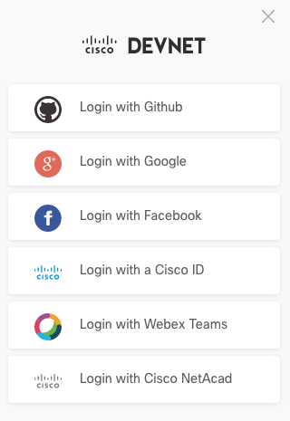
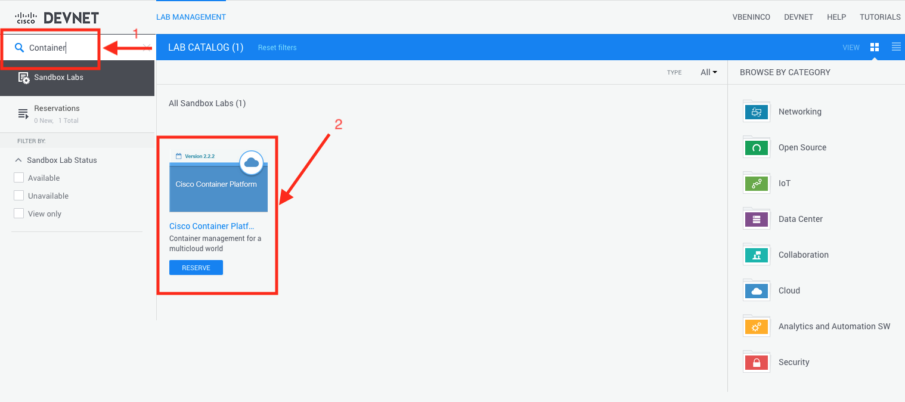
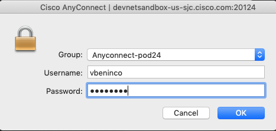
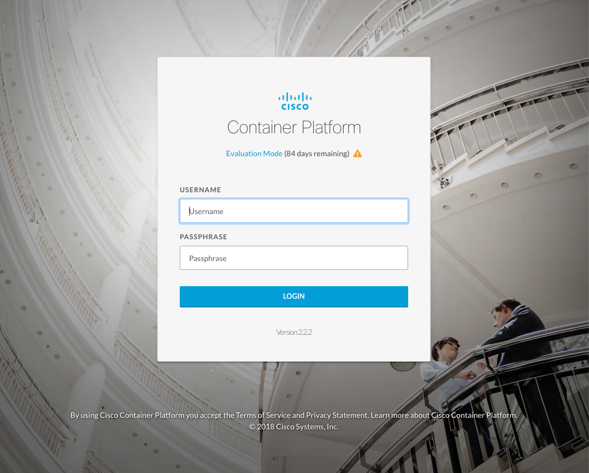
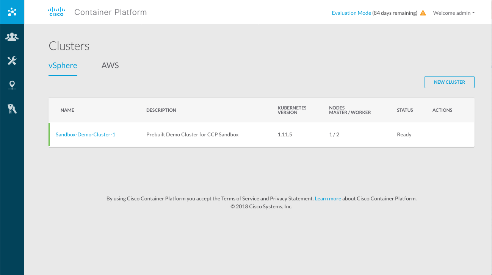
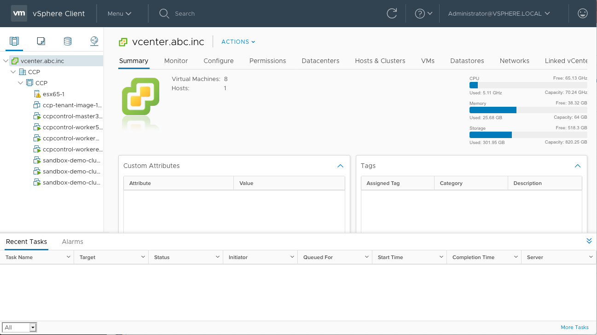

# 1. DevNet Sandbox

We need a quick and free Kubernetes to start our application development.  You could use a laptop with [minikube](https://github.com/kubernetes/minikube) and if that's your thing go for it.  We will use a free [Cisco DevNet sandbox](https://developer.cisco.com/site/sandbox/) that we've already provisioned for this workshop.

# 1.1 Sign up with DevNet

We recommend you [sign up](https://developer.cisco.com/site/sandbox/).  It is free if you haven't done so and you can use your own ID from Github, Cisco, Google, etc. 

# 1.2 Reserve Cisco Container Platform sandboox

There are quite a few sandbox environments available.  We will choose the Cisco Container Platform.  Find it by searching for `container` and then reserving the Cisco Container Platform one.

# 1.3 Connect via VPN

Once your reservation is ready you will receive an email with information on how to connect. 

## 1.3.1 Download/Install Cisco Anyconnect

You will need to download Cisco AnyConnect.

* [Download the Cisco AnyConnect VPN Client Software](https://developer.cisco.com/site/sandbox/anyconnect/)
* [Installation Guide for the Cisco AnyConnect VPN Client Software](https://devnetsandbox.cisco.com/Docs/VPN_Access/AnyConnect_Installation_Guide.pdf)

## 1.3.2 Connect to your VPN account

The instructions will come with the VPN account information.  This can then by typed into the AnyConnect client.

## 1.4 Log into Consoles
At this point you should be ready to login to the Cisco Container Platform dashboard and begin the rest of the labs.  Before continuing make sure you can log into the following: 

### Cisco Container Platform
[ https://10.10.20.110]( https://10.10.20.110)

__User/Password:__ `admin/Cisco123`

### VMware vCenter
[ https://10.10.20.12]( https://10.10.20.12)

__User/Password:__ `administrator@vsphere.local/Cisco123!`

## Where to next?

* [Home](../README.md)
* [Next Module: CCP Kubernetes](../kubernetes/README.md)

