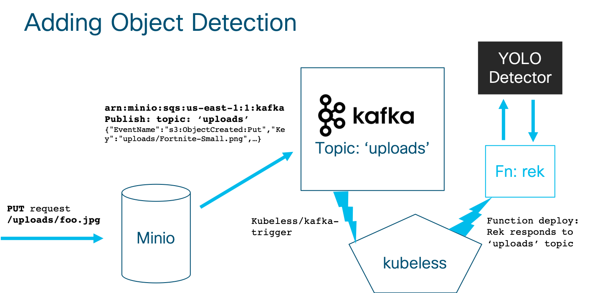
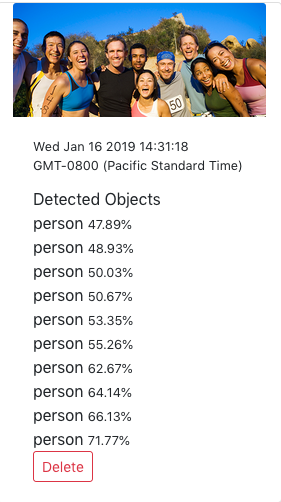

# 10. Object Recognition

Object Recognition in photos has made many advances in the last several years.  The advances have come from more data, better algorithms, and mountains of cheap computing power. 

## 10.1 Introducing YOLO

[YOLO](https://pjreddie.com/darknet/yolo/) (You Only Look Once) is a real-time object detection algorithm with a [flexible license](https://github.com/pjreddie/darknet/blob/master/LICENSE.fuck).  Like many machine learning algorithms it is open source and we are able to use it in many different applications free of charge. 


(source: [YOLO homepage](https://pjreddie.com/darknet/yolo/))

We will take an implementation of this algorithm, that has already been trained, and use that model to do object recognition inside the photos that we upload.  We will then *tag* the data in our photos with the objects that the algorithm recognizes.

## 10.2 Install YOLO Detector

I have made a small application for you, called [YOLO Detector](https://github.com/vallard/YOLO-Detector).  It embeds the YOLO algorithm and model in a Tensorflow implementation and does the image detection for you.  Because the model is (relatively) small it doesn't recognize many things.  It can detect the following objects:

* aeroplane
* bicycle
* bird
* boat
* bottle
* bus
* car
* cat
* chair
* cow
* diningtable
* dog
* horse
* motorbike
* person
* pottedplant
* sheep
* sofa
* train
* tvmonitor

So don't expect too much!  

Let's install it by running:

```
kubectl apply -f https://raw.githubusercontent.com/vallard/YOLO-Detector/master/manifests/yolo-detector.yaml
```

This will create a deployment and a service in Kubernetes called `yolo`.  It may take a while to pull as the image is about 2GB.  This is because the model is *BIG*. 

## 10.3 Hooking Things Up

We have a service, but we need an event mechanism to invoke the function.  How can we hook it up to the application? 

Currently it stands alone as a separate service.  We could have it be called as another webhook similar to how the image is called.  But why not go for scale here and instead use [Kafka](https://kafka.apache.org/)?  That way we can create a [Pub/Sub](https://en.wikipedia.org/wiki/Publish%E2%80%93subscribe_pattern) mechanism to deal with at scale. 

 

## 10.4 Kafka

We could install Kafka using helm or other ways, but we will use the sample Kubeless version, as it hooks everything up for us. 

### 10.4.1 Install Kafka and Kubeless Kafka plugin

```
export RELEASE=$(curl -s https://api.github.com/repos/kubeless/kafka-trigger/releases/latest | grep tag_name | cut -d '"' -f 4)
kubectl create -f https://github.com/kubeless/kafka-trigger/releases/download/$RELEASE/kafka-zookeeper-$RELEASE.yaml
```

Verify the containers come up.  They will be in the `kubeless` namespace.  Do you remember how to check if pods are up in a namespace? 


### 10.4.2 Test and Verify Kafka installation 

We will deploy a test client that we can use to verify Kafka. 

```
kubectl create -f https://raw.githubusercontent.com/vallard/K8sServerless/master/yolo/kafka-testclient.yaml
``` 

We can now list the different topics within it:

```
kubectl exec testclient -- /usr/bin/kafka-topics --zookeeper zoo.kubeless:2181 --list
```

Most likely nothing will be displayed.  We haven't created any topics yet!


Create the `uploads` topic if it hasn't been created:

```
kubectl -n default exec testclient \
   -- /usr/bin/kafka-topics --zookeeper \
   zoo.kubeless:2181 --topic uploads --create \
   --partitions 1 --replication-factor 1
```

Now we can listen to the messages on this topic:

```
kubectl -n default exec -it testclient -- /usr/bin/kafka-console-consumer --bootstrap-server kafka.kubeless:9092 --topic uploads --from-beginning
```

You may want to keep this window up as you do the next parts, to verify things are happening.  To stop the listener session above press `Ctrl+C`.

## 10.5 Minio as a Kafka Producer

Next we need to turn Minio into a Kafka producer.  We want a message to be emitted when photos are uploaded to the `uploads` topic.  Run the command:

```
mc event add minio/uploads arn:minio:sqs:us-east-1:1:kafka --event put
```

### 10.5.1 Troubleshooting

If you get an error like:

```
mc: <ERROR> Cannot enable notification on the specified bucket. A specified destination ARN does not exist or is not well-formed. Verify the destination ARN.
```

It may be that Minio gave up looking for the Kafka server we set in its config.  Run the command:

```
mc admin info minio
```

If you don't see Kafka in there, then restart the pod: 

```
kubectl delete pod fonkfe-xxxxx
```

Then after the container restarts, try re-running the command: 

```
mc event add minio/uploads arn:minio:sqs:us-east-1:1:kafka --event put
```

## 10.6 Add Kubeless Function for processing Images

Next let's create a function that can be called as messages come in from Kafka.  

Get the function from [here](https://raw.githubusercontent.com/vallard/K8sServerless/master/yolo/rek.py), or alternatively it is in the `./K8sServerless/yolo` directory.  You will also need the `requirements.txt` file available [here](https://raw.githubusercontent.com/vallard/K8sServerless/master/yolo/requirements.txt).

To do this we run: 

```
kubeless function deploy rek --runtime python2.7 \
                    --handler rek.process_event \
                    --dependencies requirements.txt \
                    --from-file rek.py
```

## 10.7 Add Kubeless Trigger
Finally we need to tie the Kafka trigger to the function: 

```
kubeless trigger kafka create rek --function-selector created-by=kubeless,function=rek --trigger-topic uploads
```

Now you should be able to upload an image from the photobook URL, e.g:

```
http://10.10.20.201:9000/photobook/index.html
```

Then, after waiting a bit, if you refresh the page you will see that it tries to recognize the objects it *sees* in the page.



In the above picture we see that it recognized 10 different people with different degrees of certainty.  

__Note:__ You have to upload a new picture as the event is only triggered on new uploads.  Previous uploads won't do anything.  

## 10.8 Bonus Challenge Exercise

If you want to make changes to the `rek.py` function you can then re-upload it using: 

```
kubeless function update rek -f rek.py
```


## Reference

[https://kubeless.io/docs/pubsub-functions/#kafka](https://kubeless.io/docs/pubsub-functions/#kafka)

## Where to next?

You are done!  Congratulations! You now know everything about serverless on prem.  You can now put it on your LinkedIn profile as 'Serverless expert'... right? 

* [Go Back Home](../README.md)
* [Previous Module: serverless](../serverless/README.md)
